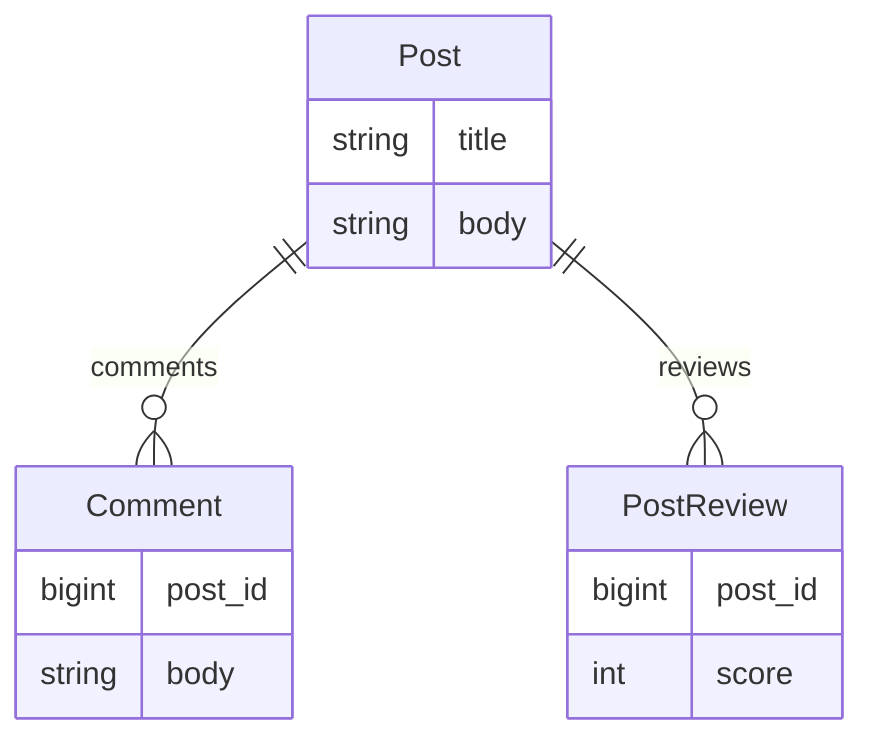

## PostReview の作成

PostReview を作成します。
簡単に投稿に対してスコアをつける形にします。(バリデーションは省略)

migrate ファイルを用意し、score を `null: false` にします。

```
$ bin/rails g model PostReview score:integer post:references
```

```ruby
# xxxx_create_post_reviews.rb
class CreatePostReviews < ActiveRecord::Migration[6.1]
  def change
    create_table :post_reviews do |t|
      t.integer :score, null: false
      t.references :post, null: false, foreign_key: true

      t.timestamps
   end
  end
end

# post_review.rb
class PostReview < ApplicationRecord
  belongs_to :post
end
```

マイグレーションします。

```
$ bin/rails db:migrate
```

Post に has-many で設定します。

```diff ruby:app/models/post.rb
class Post < ApplicationRecord
  has_many :comments, dependent: :destroy
+ has_many :reviews, class_name: 'PostReview', dependent: :destroy
end

```

```diff ruby:app/graphql/types/post_type.rb
module Types
  class PostType < Types::BaseObject
    field :average_review_score, Float, null: true
    field :body, String, null: false
    field :comments, [Types::CommentType], null: false
    field :created_at, GraphQL::Types::ISO8601DateTime, null: false
    field :id, ID, null: false
    field :title, String, null: false
    field :total_comments, Integer, null: false
    field :total_reviews, Integer, null: false
    field :updated_at, GraphQL::Types::ISO8601DateTime, null: false

    def comments
      Loaders::AssociationLoader.for(Post, :recent_comments).load(object)
    end

    def total_comments
      Loaders::AssociationCountLoader.for(Post, :comments).load(object)
    end

+   def total_reviews
+     Loaders::AssociationCountLoader.for(Post, :reviews).load(object)
+   end

+   def average_review_score
+     Loaders::AssociationCountLoader.for(Post, :reviews).load(object).then do |reviews_count|
+       Loaders::AssociationSumLoader.for(Post, :reviews, :score).load(object).then do |total_score|
+         (total_score / reviews_count.to_f).round(2)
+       end
+     end
+   end
  end
end

```

```ruby:app./graphql/loaders/association_sum_loader.rb
module Loaders
  class AssociationSumLoader < GraphQL::Batch::Loader
    def initialize(model, association_name, sum_column, where: nil)
      super()
      @model = model
      @association_name = association_name
      @reflection = reflection
      @sum_column = sum_column
      @where = where
    end

    def load(record)
      raise TypeError, "#{@model} loader can't load association for #{record.class}" unless record.is_a?(@model)

      super
    end

    def perform(records)
      sums = query(records)
      records.each do |record|
        key = record_key(record)
        fulfill(record, sums[key] || 0)
      end
    end

    private

    def reflection
      reflection = @model.reflect_on_association(@association_name)
      return reflection if reflection

      raise ArgumentError, "No association #{@association_name} on #{@model}"
    end

    def query(records)
      column = @reflection.join_primary_key
      scope = @reflection.klass
      scope = scope.where(@where) if @where
      scope.where(column => records).group(column).sum(@sum_column)
    end

    def record_key(record)
      record[@reflection.active_record_primary_key]
    end
  end
end

```